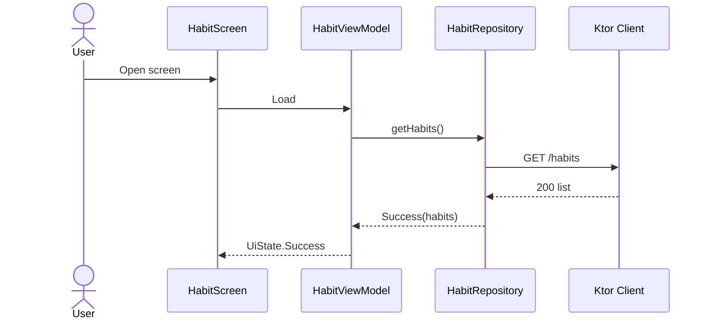
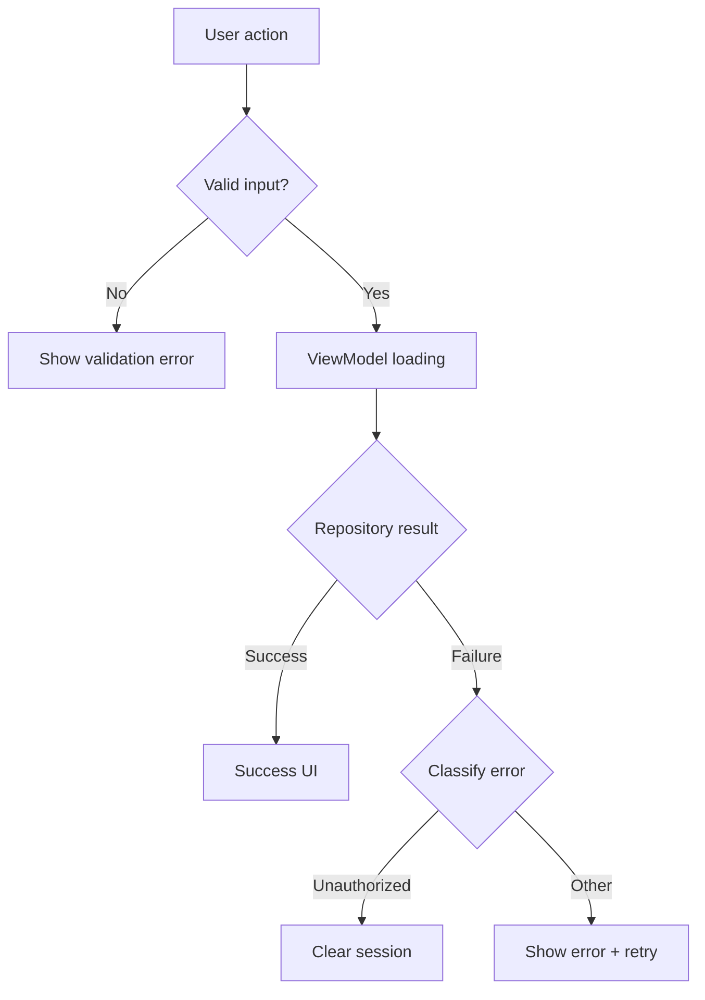

# KMP Use Case Spec — Reference

Read when discovering code, classifying gaps, or deduplicating tests.

## Documentation discovery

Run early (Step 1b). Exclude dependency caches and build output.

### Glob patterns

```text
README.md
README.MD
readme.md
**/README.md
**/Readme.md
AGENTS.md
CONTRIBUTING.md
docs/**/*.md
doc/**/*.md
**/docs/**/*.md
architecture/**/*.md
```

Skip unless the user widens scope: `node_modules/**`, `build/**`, `.gradle/**`,
`dist/**`, vendor trees.

### Read priority (highest first)

1. Repository root `README.md`, `AGENTS.md`, `CONTRIBUTING.md`
2. `docs/` or `doc/` index and architecture pages linked from root README
3. Per-module README next to `build.gradle.kts` (e.g. `server/README.md`,
   `app/shared/README.md`, `:core` module root)
4. Feature or package README deep in source (e.g. `feature/login/README.md`)
5. Adjacent markdown referenced from the above (follow relative links one level
   deep when they describe product behavior)

### What to extract (checklist)

- Product summary and user roles
- Feature list or roadmap items
- HTTP/API tables, auth model, error conventions
- Module responsibilities (“client is stateless”, “server owns persistence”)
- Testing or CI expectations mentioned in docs
- Explicit TODOs, “not yet implemented”, known bugs

### Recording in artifacts

**Scoped run** — add to `SPEC.md`:

```markdown
## Documentation context

| Source | Relevant claims |
|--------|-----------------|
| `README.md` | … |
| `server/README.md` | … |
```

**analyze-all** — consolidate in `specs/kmp-use-cases/project/DOCUMENTATION.md`
and link from each feature spec’s Documentation context (short + link to section).

## Analyze-all partitioning

Use Gradle settings + docs + package layout:

| Signal | Typical feature bundle |
|--------|-------------------------|
| `:app:shared` + package `…feature.auth` | `auth` |
| `:server` route prefix `/api/habits` | `habits-api` (pair with client habit UI) |
| README section “Notifications” | `notifications` even if code spans modules |
| `:core` only DTOs | Do not create a spec bundle unless docs define standalone contracts |

Merge bundles when they share one screen + one ViewModel + one repository graph.
Split when navigation subgraphs or README chapters are clearly separate products.

**Server + client**: For each API area, trace client repository to server routes;
one feature spec may span `:app:shared` + `:server` if docs present them as one flow.

## Discovery Patterns

Run `Glob` and `Grep` from the repository root. Adjust module paths to the project.

### ViewModels

```text
**/*ViewModel*.kt
**/*Presenter*.kt
class *ViewModel
viewModelScope
```

Prefer `commonMain` sources; note `androidMain`-only ViewModels separately.

### Repositories and data layer

```text
**/*Repository*.kt
**/*DataSource*.kt
interface *Repository
suspend fun
HttpClient
Ktor
SQLDelight
```

Map interfaces to Metro/`@Inject` implementations when Metro is used.

### Composables and navigation

```text
@Composable
**/*Screen*.kt
**/*Route*.kt
NavHost
rememberNavController
```

### Existing tests

```text
commonTest/**/*.kt
androidUnitTest/**/*.kt
**/*Test.kt
**/*ViewModelTest*
runTest
```

Link tests to use cases by target class or scenario name.

### Server (optional scope)

If the user includes backend behavior:

```text
**/server/**/*.kt
routing {
get( post( put( delete(
```

Align client repository paths with Ktor routes and DTOs in `:core`.

## Use Case ID Convention

`UC-01`, `UC-02`, … stable for the spec session. Sub-flows: `UC-01a` refresh token.

## Gap Categories

Use only categories relevant to the use case. Evidence = code path or absence.

| Category | Examples to look for |
|----------|----------------------|
| **Input validation** | blank email, max length, illegal characters, stale form state |
| **Empty / null** | empty list, null API field, missing optional DTO |
| **Network** | timeout, connection lost, 401/403, 404, 409, 5xx, malformed JSON |
| **Concurrency** | double-tap submit, in-flight cancel, race on refresh |
| **State machine** | stuck loading, error not cleared on retry, success after dispose |
| **Auth / session** | expired token, logout while request in flight |
| **Pagination / cache** | stale page, duplicate items, refresh vs append |
| **Platform** | expect/actual failure, permission denied (camera, location) |
| **Persistence** | optimistic UI rollback, server as source of truth violations |
| **Accessibility / UI** | error not announced, disabled button while loading |

**Covered** means: branch or state exists **and** (if tests exist) a test exercises
it; otherwise mark **Handled, untested**.

## Test Deduplication Rules

### Do

- One test when multiple inputs share the same handler (e.g. all 4xx → same error
  state): `should show server error when repository returns client or server failure`
- Parametrize when assertion logic is identical
- Separate tests when **UI state**, **navigation**, or **side effects** differ
- Test repository mapping and ViewModel state reduction independently when both
  contain non-trivial logic

### Do not

- List `401`, `403`, `404` as three tests if one `HttpStatusCode` branch sets the
  same `UiState.Error`
- Duplicate “Android test” and “iOS test” for pure `commonTest` ViewModel logic
- Add tests for framework behavior (e.g. `StateFlow` emission order with no app logic)

### Suggested test layers

| Layer | When |
|-------|------|
| Repository unit | HTTP client fake, DTO mapping, error mapping |
| ViewModel unit | intents → state; coroutine + turbine if used |
| Compose UI | critical interactions, multi-field validation UX |
| Integration | end-to-end only for 1–2 highest-risk flows if project already has them |

## Mermaid Conventions

### Sequence (template)



Add `alt Network failure` / `opt Cached data` when code or gap analysis requires it.

### Flowchart (template)



Use `G` only for branches that exist or are listed under **Missing**.

## KMP Stack Hints

When the project matches BitDesal-style KMP (see CI templates in this repo):

- Shared UI and ViewModels in `:app:shared` `commonMain`
- DTOs in `:core`; server persistence SQLDelight; client stateless
- Metro for DI; ban inventing Hilt/Koin patterns in recommendations
- Compose Multiplatform Material 3; prefer `viewModelScope` in ViewModels

If the project differs, follow what you find in Gradle and source sets.

## Archify (optional)

If the user wants interactive HTML diagrams and `archify` is available, convert
the approved Mermaid topology to Archify JSON (`sequence` and `workflow` types).
Mermaid in `SPEC.md` remains the source of truth for version control.
