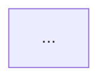

# KMP Use Case Spec: {Feature Name}

**Scope:** {module / package / screens | analyze-all → feature name}  
**Generated:** {date}  
**Repo evidence:** ViewModels, repositories, Composables, tests, and README/docs cited inline.

## Documentation context

| Source | Relevant claims |
|--------|-----------------|
| `README.md` | {flows, APIs, rules — (doc: README.md#section)} |
| `{module}/README.md` | … |

For analyze-all feature specs: link to `../DOCUMENTATION.md#{anchor}` for full detail.

## Executive summary

{2–4 sentences: number of use cases, overall test maturity, top risks.}

## Inventory

### ViewModels

| Symbol | Path | Notes |
|--------|------|-------|
| `ExampleViewModel` | `app/shared/src/commonMain/...` | … |

### Repositories

| Symbol | Path | Notes |
|--------|------|-------|
| `ExampleRepository` | … | interface + impl |

### Composables / screens

| Symbol | Path | ViewModel |
|--------|------|-----------|
| `ExampleScreen` | … | `ExampleViewModel` |

### Existing tests (relevant)

| Test | Covers |
|------|--------|
| `ExampleViewModelTest` | UC-01 happy path only |

---

## UC-01: {Use case title}

**Primary UI:** `{Composable}` (`path`)  
**ViewModel:** `{ViewModel}` (`path`)  
**Repository:** `{Repository}` (`path`)

### Happy path (observed)

1. …
2. …

### Covered today

- …
- …

### Missing or weak

| Gap | Status | Notes |
|-----|--------|-------|
| Network timeout | Not handled | Repository swallows all errors as generic message |
| Empty list | Handled, untested | `UiState.Empty` set in VM line N |

### Tests to implement

| ID | Layer | Description |
|----|-------|-------------|
| T-01-1 | ViewModel | should emit Empty when repository returns empty list |
| T-01-2 | Repository | should map timeout exception to Result failure type X |

### Sequence diagram

```mermaid
sequenceDiagram
    ...
```

### Flowchart



---

## UC-02: {Next use case}

{Repeat section structure.}

---

## Cross-cutting gaps

{Auth, logging, analytics, i18n — only if evidenced in scope.}

## Out of scope

{Explicit exclusions: server-only admin, wasm target, etc.}

## Appendix: symbol index

| Symbol | Path |
|--------|------|
| … | … |
